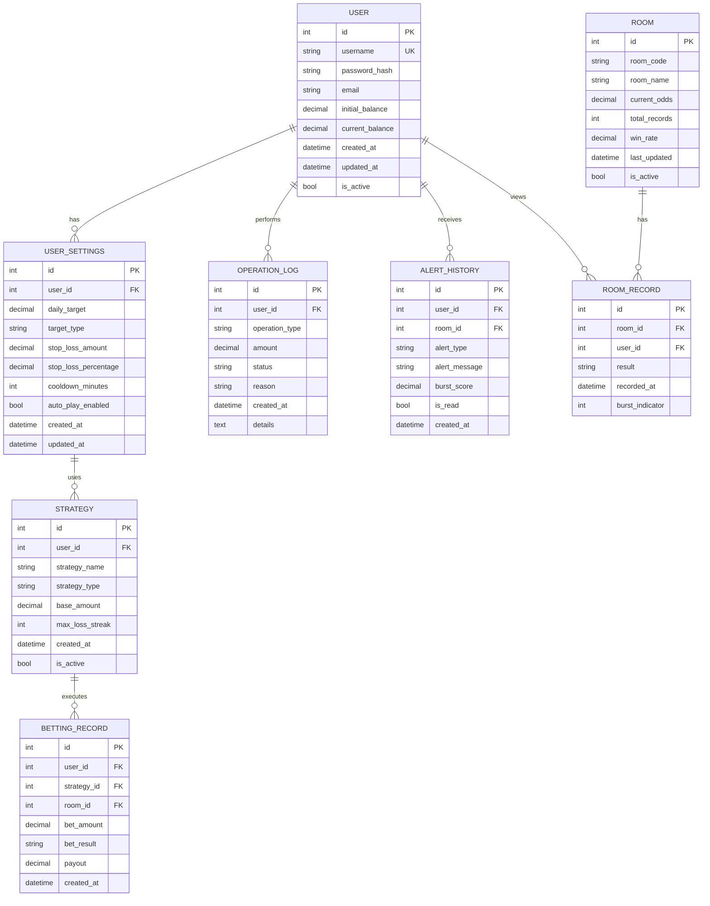

# 賽特選房系統 — 資料庫設計文件 (DB Design)

> **相關文件**：[產品需求文件 (PRD)](PRD.md)、[系統架構文件 (ARCHITECTURE.md)](ARCHITECTURE.md)、[流程圖設計 (FLOWCHART.md)](FLOWCHART.md)  
> **狀態**：v1.0  
> **資料庫**：SQLite 3.x + SQLAlchemy ORM

---

## 1. 實體關係圖 (ER Diagram)



---

## 2. 資料表詳細設計

### 2.1 USER（使用者）

**用途**：儲存系統使用者帳號與基本資訊

| 欄位 | 型別 | NULL | 說明 |
|------|------|------|------|
| id | INTEGER | NO | 主鍵，自動遞增 |
| username | VARCHAR(50) | NO | 帳號名稱，唯一索引 |
| password_hash | VARCHAR(255) | NO | 密碼雜湊值（bcrypt） |
| email | VARCHAR(100) | YES | 電子郵件 |
| initial_balance | DECIMAL(12,2) | NO | 初始本金 |
| current_balance | DECIMAL(12,2) | NO | 目前餘額 |
| created_at | DATETIME | NO | 帳號建立時間 |
| updated_at | DATETIME | NO | 最後更新時間 |
| is_active | BOOLEAN | NO | 帳號是否有效 |

**主鍵**：`id`  
**唯一索引**：`username`  
**關聯**：一個用戶有多筆設定、日誌、警告

---

### 2.2 USER_SETTINGS（使用者風控設定）

**用途**：儲存使用者的停損、出金目標等風控參數

| 欄位 | 型別 | NULL | 說明 |
|------|------|------|------|
| id | INTEGER | NO | 主鍵，自動遞增 |
| user_id | INTEGER | NO | 外鍵，關聯到 USER |
| daily_target | DECIMAL(12,2) | NO | 每日出金目標金額 |
| target_type | VARCHAR(20) | NO | 目標類型：'amount'(金額) 或 'percentage'(百分比) |
| stop_loss_amount | DECIMAL(12,2) | YES | 停損金額（絕對值） |
| stop_loss_percentage | DECIMAL(5,2) | YES | 停損百分比（相對初始本金） |
| cooldown_minutes | INTEGER | NO | 觸發停損後的冷靜期（分鐘） |
| auto_play_enabled | BOOLEAN | NO | 是否啟用自動下注 |
| created_at | DATETIME | NO | 建立時間 |
| updated_at | DATETIME | NO | 最後更新時間 |

**主鍵**：`id`  
**外鍵**：`user_id` → USER(id)  
**約束**：每個 user 最多一筆設定（可用 unique 索引）

---

### 2.3 ROOM（遊戲房間）

**用途**：儲存可選遊戲房間的基本資訊與即時統計

| 欄位 | 型別 | NULL | 說明 |
|------|------|------|------|
| id | INTEGER | NO | 主鍵，自動遞增 |
| room_code | VARCHAR(20) | NO | 房間代碼（如 A123、B456），唯一 |
| room_name | VARCHAR(100) | NO | 房間名稱 |
| current_odds | DECIMAL(5,2) | NO | 目前賠率 |
| total_records | INTEGER | NO | 累計開獎次數 |
| win_rate | DECIMAL(5,2) | NO | 勝率百分比（0-100） |
| last_updated | DATETIME | NO | 上次更新時間 |
| is_active | BOOLEAN | NO | 房間是否開放 |

**主鍵**：`id`  
**唯一索引**：`room_code`  
**關聯**：一個房間有多條開獎紀錄

---

### 2.4 ROOM_RECORD（房間開獎紀錄）

**用途**：記錄每個房間的開獎結果，用於趨勢分析與快爆預警

| 欄位 | 型別 | NULL | 說明 |
|------|------|------|------|
| id | INTEGER | NO | 主鍵，自動遞增 |
| room_id | INTEGER | NO | 外鍵，關聯到 ROOM |
| user_id | INTEGER | NO | 外鍵，關聯到 USER（誰輸入的記錄） |
| result | VARCHAR(20) | NO | 開獎結果（如 'odd', 'even', 'high', 'low'） |
| recorded_at | DATETIME | NO | 記錄時間 |
| burst_indicator | INTEGER | NO | 快爆指標（0-100，越高風險越大） |

**主鍵**：`id`  
**外鍵**：`room_id` → ROOM(id)、`user_id` → USER(id)  
**複合索引**：`(room_id, recorded_at)` 用於趨勢查詢

---

### 2.5 USER_STRATEGY（下注策略）

**用途**：儲存使用者自定義的下注策略（馬丁格爾、固定倍率等）

| 欄位 | 型別 | NULL | 說明 |
|------|------|------|------|
| id | INTEGER | NO | 主鍵，自動遞增 |
| user_id | INTEGER | NO | 外鍵，關聯到 USER |
| strategy_name | VARCHAR(100) | NO | 策略名稱（如「馬丁格爾進階版」） |
| strategy_type | VARCHAR(50) | NO | 策略類型：'fixed', 'martingale', '1-3-2-6', 'custom' |
| base_amount | DECIMAL(10,2) | NO | 基礎下注金額 |
| max_loss_streak | INTEGER | NO | 最大連敗上限 |
| created_at | DATETIME | NO | 策略建立時間 |
| is_active | BOOLEAN | NO | 是否為目前使用策略 |

**主鍵**：`id`  
**外鍵**：`user_id` → USER(id)

---

### 2.6 BETTING_RECORD（下注記錄）

**用途**：記錄系統代玩玩家執行的每筆下注操作

| 欄位 | 型別 | NULL | 說明 |
|------|------|------|------|
| id | INTEGER | NO | 主鍵，自動遞增 |
| user_id | INTEGER | NO | 外鍵，關聯到 USER |
| strategy_id | INTEGER | NO | 外鍵，關聯到 USER_STRATEGY |
| room_id | INTEGER | NO | 外鍵，關聯到 ROOM |
| bet_amount | DECIMAL(10,2) | NO | 下注金額 |
| bet_choice | VARCHAR(20) | NO | 下注選擇（如 'odd', 'even', 'high', 'low'） |
| bet_result | VARCHAR(20) | NO | 結果：'win'、'loss'、'pending'、'cancelled' |
| payout | DECIMAL(10,2) | YES | 所得獲利/損失（可為負數） |
| created_at | DATETIME | NO | 下注時間 |

**主鍵**：`id`  
**外鍵**：`user_id` → USER(id)、`strategy_id` → USER_STRATEGY(id)、`room_id` → ROOM(id)  
**複合索引**：`(user_id, created_at)` 用於使用者歷史查詢

---

### 2.7 OPERATION_LOG（操作日誌）

**用途**：記錄所有系統關鍵操作（登入、停損觸發、出金、設定變更），Append-only

| 欄位 | 型別 | NULL | 說明 |
|------|------|------|------|
| id | INTEGER | NO | 主鍵，自動遞增 |
| user_id | INTEGER | NO | 外鍵，關聯到 USER |
| operation_type | VARCHAR(50) | NO | 操作類型：'login', 'logout', 'stop_loss_triggered', 'withdrawal', 'settings_update', 'auto_play_start', 'auto_play_stop' |
| amount | DECIMAL(12,2) | YES | 操作涉及的金額 |
| status | VARCHAR(20) | NO | 狀態：'success', 'pending', 'failed' |
| reason | TEXT | YES | 操作原因/描述 |
| created_at | DATETIME | NO | 操作時間 |
| details | TEXT | YES | JSON 格式的額外詳細資訊 |

**主鍵**：`id`  
**外鍵**：`user_id` → USER(id)  
**索引**：`(user_id, created_at)` 用於快速查詢

---

### 2.8 ALERT_HISTORY（警告記錄）

**用途**：記錄系統推送給使用者的所有快爆警告和風控提示

| 欄位 | 型別 | NULL | 說明 |
|------|------|------|------|
| id | INTEGER | NO | 主鍵，自動遞增 |
| user_id | INTEGER | NO | 外鍵，關聯到 USER |
| room_id | INTEGER | NO | 外鍵，關聯到 ROOM |
| alert_type | VARCHAR(50) | NO | 警告類型：'burst_warning', 'daily_target_reached', 'stop_loss_triggered', 'system_message' |
| alert_message | TEXT | NO | 警告訊息內容 |
| burst_score | DECIMAL(5,2) | YES | 快爆評分（0-100），僅快爆警告時有值 |
| is_read | BOOLEAN | NO | 使用者是否已讀 |
| created_at | DATETIME | NO | 警告生成時間 |

**主鍵**：`id`  
**外鍵**：`user_id` → USER(id)、`room_id` → ROOM(id)  
**複合索引**：`(user_id, is_read, created_at)` 用於未讀警告查詢

---

## 3. SQL 建表語法

完整的 SQLite CREATE TABLE 語句保存在 `database/schema.sql`：

```sql
-- User 表
CREATE TABLE IF NOT EXISTS user (
    id INTEGER PRIMARY KEY AUTOINCREMENT,
    username VARCHAR(50) NOT NULL UNIQUE,
    password_hash VARCHAR(255) NOT NULL,
    email VARCHAR(100),
    initial_balance DECIMAL(12,2) NOT NULL,
    current_balance DECIMAL(12,2) NOT NULL,
    created_at DATETIME NOT NULL DEFAULT CURRENT_TIMESTAMP,
    updated_at DATETIME NOT NULL DEFAULT CURRENT_TIMESTAMP,
    is_active BOOLEAN NOT NULL DEFAULT 1
);

-- User Settings 表
CREATE TABLE IF NOT EXISTS user_settings (
    id INTEGER PRIMARY KEY AUTOINCREMENT,
    user_id INTEGER NOT NULL UNIQUE,
    daily_target DECIMAL(12,2) NOT NULL,
    target_type VARCHAR(20) NOT NULL,
    stop_loss_amount DECIMAL(12,2),
    stop_loss_percentage DECIMAL(5,2),
    cooldown_minutes INTEGER NOT NULL DEFAULT 30,
    auto_play_enabled BOOLEAN NOT NULL DEFAULT 0,
    created_at DATETIME NOT NULL DEFAULT CURRENT_TIMESTAMP,
    updated_at DATETIME NOT NULL DEFAULT CURRENT_TIMESTAMP,
    FOREIGN KEY (user_id) REFERENCES user(id) ON DELETE CASCADE
);

-- Room 表
CREATE TABLE IF NOT EXISTS room (
    id INTEGER PRIMARY KEY AUTOINCREMENT,
    room_code VARCHAR(20) NOT NULL UNIQUE,
    room_name VARCHAR(100) NOT NULL,
    current_odds DECIMAL(5,2) NOT NULL,
    total_records INTEGER NOT NULL DEFAULT 0,
    win_rate DECIMAL(5,2) NOT NULL DEFAULT 50.0,
    last_updated DATETIME NOT NULL DEFAULT CURRENT_TIMESTAMP,
    is_active BOOLEAN NOT NULL DEFAULT 1
);

-- Room Record 表
CREATE TABLE IF NOT EXISTS room_record (
    id INTEGER PRIMARY KEY AUTOINCREMENT,
    room_id INTEGER NOT NULL,
    user_id INTEGER NOT NULL,
    result VARCHAR(20) NOT NULL,
    recorded_at DATETIME NOT NULL DEFAULT CURRENT_TIMESTAMP,
    burst_indicator INTEGER NOT NULL DEFAULT 0,
    FOREIGN KEY (room_id) REFERENCES room(id) ON DELETE CASCADE,
    FOREIGN KEY (user_id) REFERENCES user(id) ON DELETE CASCADE
);

-- User Strategy 表
CREATE TABLE IF NOT EXISTS user_strategy (
    id INTEGER PRIMARY KEY AUTOINCREMENT,
    user_id INTEGER NOT NULL,
    strategy_name VARCHAR(100) NOT NULL,
    strategy_type VARCHAR(50) NOT NULL,
    base_amount DECIMAL(10,2) NOT NULL,
    max_loss_streak INTEGER NOT NULL DEFAULT 5,
    created_at DATETIME NOT NULL DEFAULT CURRENT_TIMESTAMP,
    is_active BOOLEAN NOT NULL DEFAULT 0,
    FOREIGN KEY (user_id) REFERENCES user(id) ON DELETE CASCADE
);

-- Betting Record 表
CREATE TABLE IF NOT EXISTS betting_record (
    id INTEGER PRIMARY KEY AUTOINCREMENT,
    user_id INTEGER NOT NULL,
    strategy_id INTEGER NOT NULL,
    room_id INTEGER NOT NULL,
    bet_amount DECIMAL(10,2) NOT NULL,
    bet_choice VARCHAR(20) NOT NULL,
    bet_result VARCHAR(20) NOT NULL DEFAULT 'pending',
    payout DECIMAL(10,2),
    created_at DATETIME NOT NULL DEFAULT CURRENT_TIMESTAMP,
    FOREIGN KEY (user_id) REFERENCES user(id) ON DELETE CASCADE,
    FOREIGN KEY (strategy_id) REFERENCES user_strategy(id) ON DELETE CASCADE,
    FOREIGN KEY (room_id) REFERENCES room(id) ON DELETE CASCADE
);

-- Operation Log 表
CREATE TABLE IF NOT EXISTS operation_log (
    id INTEGER PRIMARY KEY AUTOINCREMENT,
    user_id INTEGER NOT NULL,
    operation_type VARCHAR(50) NOT NULL,
    amount DECIMAL(12,2),
    status VARCHAR(20) NOT NULL DEFAULT 'success',
    reason TEXT,
    created_at DATETIME NOT NULL DEFAULT CURRENT_TIMESTAMP,
    details TEXT,
    FOREIGN KEY (user_id) REFERENCES user(id) ON DELETE CASCADE
);

-- Alert History 表
CREATE TABLE IF NOT EXISTS alert_history (
    id INTEGER PRIMARY KEY AUTOINCREMENT,
    user_id INTEGER NOT NULL,
    room_id INTEGER NOT NULL,
    alert_type VARCHAR(50) NOT NULL,
    alert_message TEXT NOT NULL,
    burst_score DECIMAL(5,2),
    is_read BOOLEAN NOT NULL DEFAULT 0,
    created_at DATETIME NOT NULL DEFAULT CURRENT_TIMESTAMP,
    FOREIGN KEY (user_id) REFERENCES user(id) ON DELETE CASCADE,
    FOREIGN KEY (room_id) REFERENCES room(id) ON DELETE CASCADE
);

-- 建立常用索引
CREATE INDEX IF NOT EXISTS idx_user_settings_user_id ON user_settings(user_id);
CREATE INDEX IF NOT EXISTS idx_room_record_room_id ON room_record(room_id);
CREATE INDEX IF NOT EXISTS idx_room_record_user_id ON room_record(user_id);
CREATE INDEX IF NOT EXISTS idx_room_record_recorded_at ON room_record(recorded_at);
CREATE INDEX IF NOT EXISTS idx_betting_record_user_id ON betting_record(user_id);
CREATE INDEX IF NOT EXISTS idx_betting_record_created_at ON betting_record(created_at);
CREATE INDEX IF NOT EXISTS idx_operation_log_user_id ON operation_log(user_id);
CREATE INDEX IF NOT EXISTS idx_operation_log_created_at ON operation_log(created_at);
CREATE INDEX IF NOT EXISTS idx_alert_history_user_id ON alert_history(user_id);
CREATE INDEX IF NOT EXISTS idx_alert_history_is_read ON alert_history(is_read);
```

---

## 4. 設計決策與說明

### 4.1 為什麼使用 SQLAlchemy ORM？

- **易於維護**：Python 物件映射，無需手寫 SQL
- **型別安全**：減少 SQL injection 風險
- **自動遷移**：使用 Flask-Migrate 輕鬆處理 schema 變更
- **跨資料庫相容**：若日後從 SQLite 遷移至 PostgreSQL 或 MySQL，修改最少

### 4.2 時間欄位設計

- 所有時間欄位皆採 `DATETIME` + `DEFAULT CURRENT_TIMESTAMP`
- 在 ORM 層以 ISO 8601 格式（如 `2026-04-24T15:30:00`）儲存或轉換
- 利於國際化與跨時區操作

### 4.3 停損設計

- 支援**絕對金額停損**（`stop_loss_amount`）與**百分比停損**（`stop_loss_percentage`）
- 使用者可同時設定兩者，系統觸發先達成的條件
- 例：初始本金 10,000，可設定「虧損 2,000 元」或「虧損 20%」

### 4.4 Append-Only Log Pattern

- `operation_log` 與 `alert_history` 遵循 Append-Only 設計原則
- **不允許更新或刪除歷史紀錄**，保證追溯性與審計透明度
- 使用者操作變更僅能**新增**，不能修改過去的記錄

### 4.5 外鍵約束

- 使用 `ON DELETE CASCADE` 簡化刪除邏輯
- 刪除使用者時，自動刪除相關的所有設定、日誌、警告
- 讀取性能優先於寫入頻率（SQLite 本身適合此場景）

---

## 5. 資料庫初始化

### 5.1 推薦初始化流程

1. **Flask 啟動時自動建表**
   ```python
   from flask import Flask
   from app.models import db
   
   app = Flask(__name__)
   with app.app_context():
       db.create_all()  # SQLAlchemy 自動執行 schema
   ```

2. **或者使用命令行工具**
   ```bash
   flask db init
   flask db migrate
   flask db upgrade
   ```

### 5.2 測試資料種子 (Seed Data)

初次運行時可預加入測試房間與預設策略，方便使用者快速上手。

---

*本文件由資料庫設計 Skill 產出，請開發團隊審閱後正式確認。*
