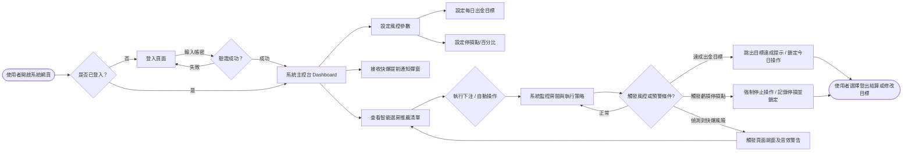
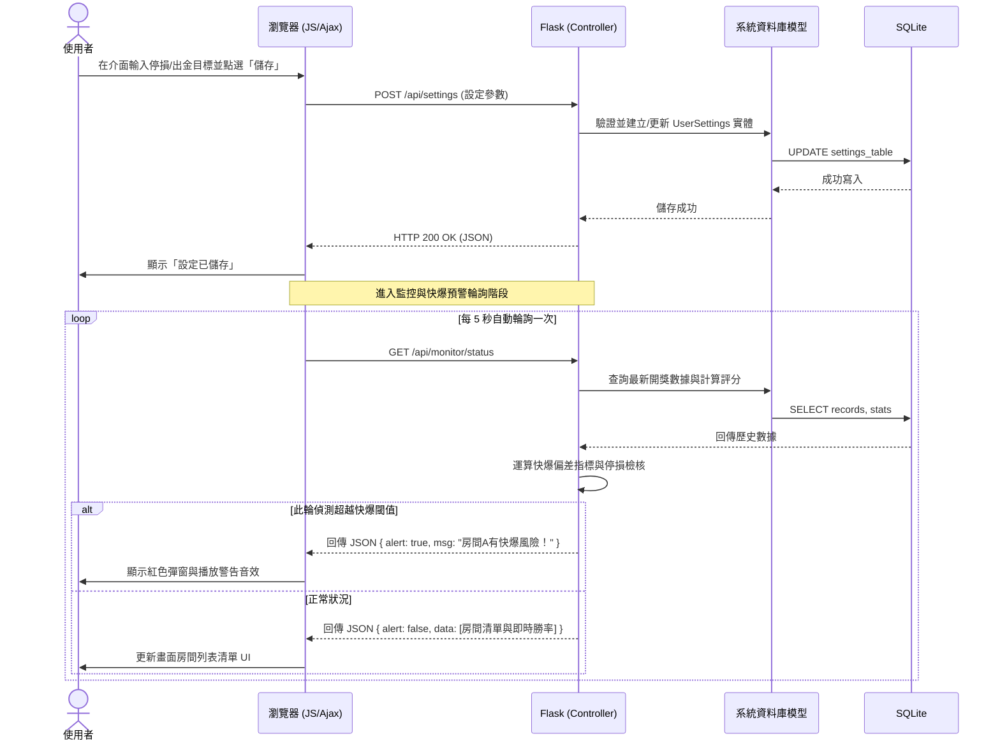

# 賽特選房系統 — 系統流程圖與功能對照

> **相關文件**：[產品需求文件 (PRD)](PRD.md)、[系統架構文件 (ARCHITECTURE.md)](ARCHITECTURE.md)
> **狀態**：初版設計

---

## 1. 使用者流程圖 (User Flow)

此流程圖展示了使用者（玩家／代操者）進入系統後的操作路徑，涵蓋登入、查看推薦房間、設定出金與停損，以及遭遇系統警告或停損鎖定時的流程。

## 2. 系統序列圖 (Sequence Diagram)

這裡以「使用者設定停損與出金目標，並啟動系統取得即時快爆預警」為例，展示前端瀏覽器、Flask 後端與 SQLite 之間的資料傳遞時序。

## 3. 功能清單對照表

對應 PRD 定義的 MVP 範圍與架構設計，以下是具體落實在 Flask 系統內的路由與功能對照。

| 功能描述 | URL 路由路徑 (Route) | HTTP 方法 | 對應的 Controller / 處理模組 | 說明 |
| -------- | ------------------- | --------- | ------------------------ | ---- |
| **登入頁面** | `/login` | GET | `auth.py` | 渲染 `login.html`，提供帳號密碼輸入介面。 |
| **執行登入** | `/login` | POST | `auth.py` | 接收表單，驗證通過寫入 Session 並重導向至主控台。 |
| **登出系統** | `/logout` | GET | `auth.py` | 清除 Session 並導回登入頁。 |
| **首頁與主控台** | `/` 或 `/dashboard` | GET | `dashboard.py` | 渲染 `index.html`，顯示目前設定的停損出金目標及推薦房間清單。 |
| **歷史日誌查詢** | `/logs` | GET | `dashboard.py` | 渲染 `logs.html`，顯示 Append-only 寫入的所有操作與風控觸發紀錄。 |
| **更新風控設定** | `/api/settings` | POST | `strategy.py` | 接收 Ajax 請求，更新資料庫中使用者的出金目標與停損百分比。 |
| **取得快爆分析** | `/api/monitor/status` | GET | `api.py` | 對應前端 `setInterval` 呼叫，運算偏差並回傳 JSON 格式的預警。 |
